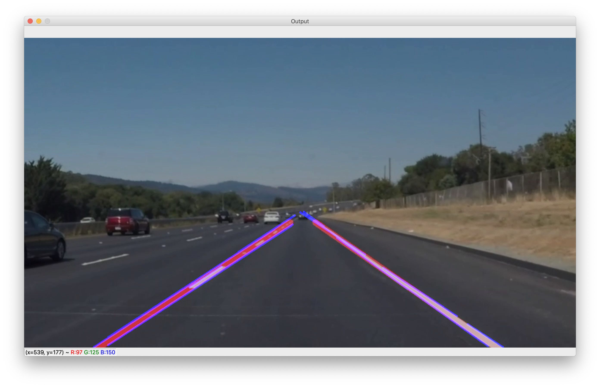

# CSE-4019-19BCE2199

**Review 2 progress for CSE-4019 J Component**

**Project Name:** Lane Detection for Self Driving Cars

**Project Arena:** Image Segmentation

## Progress till now


As we can see the red lines detected on the lanes



As we can see the blue and red-filled lines detected as the car moves on the road in the video dataset

## Remaining & Future work

```

1. Streaming for Video generated Output
2. Fix detection on Curve roads 
3. Rescaling video in accordance to ratio display

```

**Video Dataset** = [link](https://www.youtube.com/playlist?list=PLPuW_E3R2ZUltRVlWuM3ngtL3jvScTj-Y)

